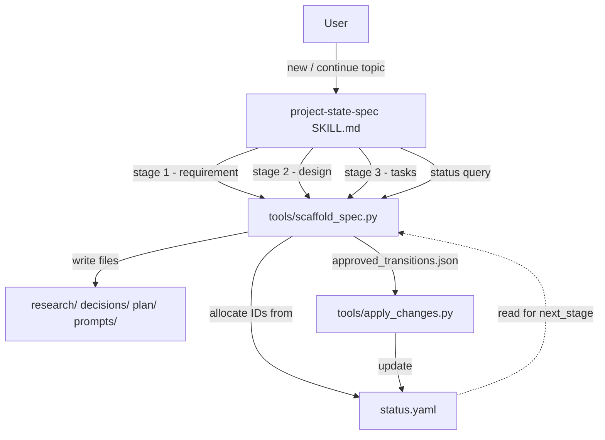

# Design Document: project-state-spec

> A skill that guides users through a Requirement → Design → Task three-stage workflow, generating PST five-stage artifacts (R + D + Plan + LP + TP) under the hood.

## Overview

`project-state-spec` is a prompt-driven workflow skill that lets a user produce a complete spec set for any feature using a familiar three-stage rhythm — Requirements, Design, Tasks — while quietly producing PST-conformant artifacts (R, D, Plan, LP, TP) on disk and registering them through `apply_changes.py`.

It positions itself as a **semantic wrapper above project-state-tracker (PST)**: the user thinks in three stages, but the file system, status state machine, dependency graph, and handoff infrastructure are all PST's. The skill never invents new artifact types, never edits status.yaml directly except via the existing `apply_changes.py` pipeline, and never bypasses the PST state machine.

The skill is intended for projects that already use PST and want a lighter conversational on-ramp than running INIT_FROM_DOCS over hand-written R/D/Plan/LP/TP files.

### Design boundaries

- **Two entry commands:** `Skill project-state-spec + new <topic>` and `Skill project-state-spec + continue <topic>`.
- **Three conversation stages:** Requirement (writes R + D), Design (writes Plan), Tasks (writes LP[] + TP[] and the landing README).
- **Default rhythm is continuous;** every stage ends with an explicit "continue / pause" gate, so the user can stop and resume across sessions.
- **TP is mandatory:** every LP gets exactly one paired TP, so PST's `landing_requires_test_ready` quality gate stays meaningful.
- **The skill itself writes nothing to status.yaml directly.** A companion script `tools/scaffold_spec.py` does ID allocation, file writes, and `apply_changes.py` invocation.

### Non-goals

- Not a replacement for PST INIT or AUDIT — it complements them.
- Not an executor — does not run LPs (that is `Execute-LandingPrompt`'s job). The skill's terminal state is "spec generated and registered".
- Not a Kiro IDE feature — produces plain markdown/yaml in PST conventions, usable in any editor.

## Architecture



### Stage-to-artifact mapping (decision: scheme b + cut 1)

| Three-stage user view | PST artifacts produced | Files on disk |
|---|---|---|
| Requirement | R-NNN (research_finding), D-NNN (decision) | `research/R-NNN-<topic>.md`, `decisions/D-NNN-<topic>.yaml` |
| Design | Plan.<topic> (plan) | `plan/<YYYY-MM-DD>-<topic>-design.md` |
| Tasks | LP-001..N (landing_prompt), TP-001..N (test_prompt) | `prompts/landing/LP-NNN-<slug>.md`, `prompts/test/TP-NNN-<slug>.md`, `prompts/landing/README.md` |

**Cut between R and D:** R holds *facts* (current state, constraints, references). D holds *decisions* (User Stories + EARS-formatted Acceptance Criteria). This matches PST's existing semantics — R is "fact only", D is "decision based on facts" — and keeps the conversation clean: first ask "what is the current state?", then ask "given that, what do we decide to build, and what are the acceptance criteria?".

### Conversation flow (default continuous, interruptible at every stage)

```mermaid
graph LR
    Start[new topic] --> ReqStep1[Stage 1.1: Probe context]
    ReqStep1 --> ReqStep2[Stage 1.2: Draft R]
    ReqStep2 --> ReqStep3[Stage 1.3: Draft D]
    ReqStep3 --> ReqGate{Continue?}
    ReqGate -->|pause| Pause1[Stop. status.yaml has R, D in draft]
    ReqGate -->|continue| DesStep1[Stage 2.1: Read R+D, scan code]
    DesStep1 --> DesStep2[Stage 2.2: Propose 2-3 architectures]
    DesStep2 --> DesStep3[Stage 2.3: Draft Plan]
    DesStep3 --> DesGate{Continue?}
    DesGate -->|pause| Pause2[Stop. status.yaml has Plan in draft]
    DesGate -->|continue| TaskStep1[Stage 3.1: Decompose into tasks]
    TaskStep1 --> TaskStep2[Stage 3.2: Generate LP+TP per task]
    TaskStep2 --> TaskStep3[Stage 3.3: Write landing README]
    TaskStep3 --> Done[Spec complete. Suggest ELP next.]

    Resume[continue topic] --> Query[Query scaffold_spec.py status]
    Query --> Branch{next_stage?}
    Branch -->|requirement| ReqStep1
    Branch -->|design| DesStep1
    Branch -->|tasks| TaskStep1
    Branch -->|done| Modify[Spec done. Ask which stage to revise.]
```



## Components and Interfaces

### Component 1: SKILL.md (prompt-driven conversation)

The skill file is a single markdown document parsed by the agent. It defines:

- **Invocation patterns:**
  - `Skill project-state-spec + new <topic>` — bootstrap a new spec from stage 1
  - `Skill project-state-spec + continue <topic>` — query progress, resume from `next_stage`
- **Per-stage protocol:** for each of the three stages, a sequence of probing questions, content-drafting templates, an explicit user-confirmation gate, and a script invocation contract.
- **EARS validation hints:** before calling the script for stage 1, the agent self-checks that all Acceptance Criteria use SHALL/WHEN/IF clauses.
- **Pause/resume language:** every stage ends with a fixed prompt asking "continue or pause?" so the agent does not silently push forward.

The skill does not contain any code. All side effects flow through `scaffold_spec.py`.

### Component 2: tools/scaffold_spec.py (script with side effects)

Single-file Python CLI. Responsibilities: ID allocation, file writing (markdown/yaml under PST conventions), `approved_transitions.json` construction, `apply_changes.py` invocation, status query.

**CLI surface:**

```
scaffold_spec.py --stage requirement --topic <slug> \
    --r-content <tmpfile> --d-content <tmpfile> --pst-root <path> [--force]

scaffold_spec.py --stage design --topic <slug> \
    --plan-content <tmpfile> --pst-root <path> [--force]

scaffold_spec.py --stage tasks --topic <slug> \
    --tasks-manifest <tmpfile> --pst-root <path> [--force]

scaffold_spec.py --stage status --topic <slug> --pst-root <path>
```

**Stage `requirement` behavior:**
1. Read `<pst-root>/status/status.yaml`. Find max existing `R-NNN` and `D-NNN` ids; allocate next sequential.
2. Read R content from tmpfile; write `research/R-NNN-<topic>.md` with auto-prepended `# R-NNN: <title>` header.
3. Read D content from tmpfile; write `decisions/D-NNN-<topic>.yaml` with auto-prepended `id: D-NNN`, `title:`, `based_on: [R-NNN]`.
4. Construct `status/.cache/approved_transitions.json`:
   ```json
   {
     "event_summary": "project-state-spec scaffold: requirement stage for <topic>",
     "event_type": "spec_scaffold",
     "transitions": [
       {"artifact": "R-NNN", "type": "research_finding", "from": null, "to": "draft", "reason": "...", "source": "project-state-spec"},
       {"artifact": "D-NNN", "type": "decision", "from": null, "to": "draft", "depends_on": ["R-NNN"], "reason": "...", "source": "project-state-spec"}
     ]
   }
   ```
5. Invoke `python tools/apply_changes.py --project <pst-root>`.
6. Emit JSON to stdout: `{"r_id": ..., "d_id": ..., "r_path": ..., "d_path": ...}`.

**Stage `design` behavior:**
1. Locate R and D for `<topic>` via path-suffix match in status.yaml `artifacts[]`. If missing, exit 2 with message "run --stage requirement first".
2. Allocate Plan id: `Plan.<topic>` (PST fallback slug rule).
3. Read Plan content; write `plan/<YYYY-MM-DD>-<topic>-design.md` with auto-prepended `# Plan.<topic>: <title>` header and `based_on: [R-NNN, D-NNN]` frontmatter.
4. Construct transition for Plan with `depends_on: [R-NNN, D-NNN]`, source `project-state-spec`. Invoke `apply_changes.py`.
5. Emit `{"plan_id": ..., "plan_path": ...}`.

**Stage `tasks` behavior:**
1. Locate Plan.<topic>; if missing, exit 2.
2. Parse `--tasks-manifest` JSON:
   ```json
   {
     "tasks": [
       {
         "slug": "create-path-utils",
         "lp_content": "<tmpfile>",
         "tp_content": "<tmpfile>",
         "validates_ac": ["AC-1", "AC-2"],
         "validates_property": ["P1"]
       }
     ],
     "lp_sequence": ["create-path-utils", ...],
     "coding_standards": "<optional>"
   }
   ```
3. For each task: allocate `LP-NNN`, `TP-NNN` (sequential, in manifest order). Write `prompts/landing/LP-NNN-<slug>.md` and `prompts/test/TP-NNN-<slug>.md`.
4. Write `prompts/landing/README.md` containing:
   - YAML front-matter (`source_root`, `scope`, `pst_root`) read from status.yaml `meta`. If `meta.source_root` missing or placeholder, write `"<未配置>"` and emit a warning to stderr.
   - `## LP 序列` body section (joined from `lp_sequence` with ` -> `).
   - `## Coding Standards` (verbatim from manifest if present).
5. Construct one batch of transitions:
   - Each LP: `from: null → to: draft`, `depends_on: [Plan.<topic>]`, `consumes_handoffs: []` (handoff chaining is left to ELP at execution time).
   - Each TP: `from: null → to: draft`, `depends_on: [LP-NNN]` for the matching LP.
6. Single `apply_changes.py` invocation for the whole batch.
7. Emit `{"tasks": [{"slug": ..., "lp_id": ..., "tp_id": ..., "lp_path": ..., "tp_path": ...}, ...]}`.

**Stage `status` behavior:** read-only query. Look up R/D/Plan by topic slug; count LPs whose `depends_on` includes `Plan.<topic>`; same for TPs. Emit:
```json
{
  "topic": "<slug>",
  "stages": {
    "requirement": {"complete": <bool>, "r_id": "...", "d_id": "..."},
    "design": {"complete": <bool>, "plan_id": "..."},
    "tasks": {"complete": <bool>, "lp_count": <int>, "tp_count": <int>}
  },
  "next_stage": "<requirement|design|tasks|done>"
}
```

`next_stage = done` only when all three stages are non-empty AND every LP has a paired TP.

### Component 3: tools/_spec_helpers.py (shared utilities)

Pure functions, no side effects:

- `next_id(status_yaml: dict, prefix: str) -> str` — scans `artifacts[]` (and `research_findings[]` / `decisions[]` if applicable), returns `<prefix>-<max+1>` zero-padded to 3 digits.
- `find_artifact_by_topic(status_yaml: dict, topic: str, artifact_type: str) -> Optional[dict]` — matches by path suffix `<topic>.md` or `<topic>.yaml`.
- `today_iso() -> str` — returns `YYYY-MM-DD` in UTC.
- `slugify(text: str) -> str` — lowercase, replace whitespace and non-ASCII with `-`, collapse repeats, strip edges.
- `load_status(pst_root: str) -> dict` and `safe_write(path: str, content: str, force: bool)` — IO helpers with consistent error messages.

## Data Models

### Tasks manifest (input to stage 3)

```typescript
interface TasksManifest {
  tasks: Array<{
    slug: string;                        // kebab-case, used in filenames
    lp_content: string;                  // tmpfile path containing LP markdown
    tp_content: string;                  // tmpfile path containing TP markdown
    validates_ac: string[];              // e.g. ["AC-1-1", "AC-2-3"]
    validates_property: string[];        // e.g. ["P1", "P4"]
  }>;
  lp_sequence: string[];                 // ordered slugs for LP execution chain
  coding_standards?: string;             // optional, copied verbatim into landing README
}
```

### Script return types (stdout JSON)

```typescript
type RequirementResult = {
  r_id: string;     // e.g. "R-005"
  d_id: string;     // e.g. "D-003"
  r_path: string;   // relative to pst_root
  d_path: string;
};

type DesignResult = {
  plan_id: string;  // e.g. "Plan.readme-guide-button"
  plan_path: string;
};

type TasksResult = {
  tasks: Array<{
    slug: string;
    lp_id: string;
    tp_id: string;
    lp_path: string;
    tp_path: string;
  }>;
};

type StatusResult = {
  topic: string;
  stages: {
    requirement: { complete: boolean; r_id?: string; d_id?: string };
    design:      { complete: boolean; plan_id?: string };
    tasks:       { complete: boolean; lp_count: number; tp_count: number };
  };
  next_stage: "requirement" | "design" | "tasks" | "done";
};
```

### File templates

**R-NNN-<topic>.md:**
```markdown
# R-NNN: <Title-cased topic>

## Background
<触发点 / 上下文>

## Current State
<现状描述、相关代码/产物指针>

## Constraints
<技术 / 性能 / 合规 / 风格>

## References
<外部链接 + 内部 artifact ID 引用>
```

**D-NNN-<topic>.yaml:**
```yaml
id: D-NNN
title: <topic-titled>
status: draft
based_on: [R-NNN]
problem_statement: <一句话问题>
decision: |
  <决定做什么，含 User Stories 列表>
acceptance_criteria:
  - id: AC-1
    user_story: "As a <role>, I want <feature>, so that <benefit>."
    statements:
      - "WHEN ..., THE system SHALL ..."
      - "IF ..., THEN ..."
rationale: <为什么这么决定>
alternatives_considered:
  - option: <选项 A>
    rejected_because: <理由>
```

**LP-NNN-<slug>.md:** follows the format documented in `Execute-LandingPrompt/SKILL.md` — Goal, Allowed Files, Steps, Acceptance Gates (referencing AC-N and Property-N), Handoff Plan.

**TP-NNN-<slug>.md:** Test Goal, Validates (AC + Property), Test Cases (property/unit/integration with concrete generators and assertions), Pass Criteria.

**prompts/landing/README.md:** matches the README protocol in the existing ELP SKILL — YAML front-matter with `source_root`/`scope`/`pst_root`, `## LP 序列`, optional `## Coding Standards`.

## Correctness Properties

### Property 1: Stage ordering is enforced

*For any* spec topic, `scaffold_spec.py --stage design` SHALL fail with non-zero exit code if no R or D for that topic exists in status.yaml at the time of invocation, and `--stage tasks` SHALL fail if no Plan for that topic exists.

**Validates: Error handling matrix rows "阶段顺序违反"**

### Property 2: ID allocation is monotonic and non-colliding

*For any* sequence of `--stage requirement` invocations, the allocated `R-NNN` ids SHALL form a strictly increasing sequence with no gaps relative to the maximum R id in status.yaml at each invocation. Same property holds for `D-NNN`, `LP-NNN`, `TP-NNN`.

**Validates: ID conflict handling**

### Property 3: LP and TP are 1:1 paired in tasks stage

*For any* `--stage tasks` invocation, the number of `LP-NNN` artifacts written SHALL equal the number of `TP-NNN` artifacts written, equal to `len(manifest.tasks)`, and each TP's `depends_on` SHALL contain exactly the LP id of the same task index.

**Validates: Decision Q4 (TP mandatory)**

### Property 4: Status query reflects status.yaml state

*For any* topic, `--stage status` output SHALL satisfy: `stages.requirement.complete == true` iff R and D for that topic exist in status.yaml `artifacts[]` (and `research_findings[]` / `decisions[]` where applicable); same condition for design (Plan present) and tasks (at least one LP and one TP referencing Plan.<topic>). `next_stage` SHALL be the first stage whose `complete` is false, or `done` if all complete and LP/TP counts match.

**Validates: continue command semantics. (status.yaml is the single source of truth — disk is not re-scanned. PST AUDIT is responsible for keeping status.yaml in sync with disk.)**

### Property 5: All transitions carry source attribution

*For any* `approved_transitions.json` written by scaffold_spec.py, every transition object SHALL include `"source": "project-state-spec"`. This lets PST AUDIT distinguish skill-authored transitions from manual edits and from ELP-authored transitions.

**Validates: PST integration contract (mirrors ELP's `source: Execute-LandingPrompt` convention)**

### Property 6: Repeated invocation without --force is a no-op on disk and status.yaml

*For any* topic where stage X has already been completed, invoking `--stage X --topic <topic>` (without `--force`) SHALL exit non-zero, write nothing to disk, and not modify status.yaml.

**Validates: Idempotency / accidental overwrite protection**

### Property 7: Failed apply_changes.py does not roll back files

*For any* invocation where `apply_changes.py` exits non-zero, scaffold_spec.py SHALL leave already-written files in place and emit the underlying error to stderr with a hint that PST AUDIT will reconcile on next run.

**Validates: Error handling matrix row "apply_changes.py 调用失败"**

### Property 8: TP depends_on chain is consistent

*For any* tasks stage output where N tasks were generated, the resulting status.yaml SHALL have each `TP-K`'s `depends_on` containing the matching `LP-K` (where K is the same index in `manifest.tasks`), and each `LP-K`'s `depends_on` SHALL contain `Plan.<topic>`.

**Validates: dependency graph integrity**

## Error Handling

| Scenario | Trigger | Behavior |
|---|---|---|
| status.yaml missing | skill / script entry | Skill: tell user to run PST INIT. Script: exit 2 with message. |
| `meta.source_root` placeholder/missing | tasks stage README write | Write `"<未配置>"`, warn on stderr, continue. |
| Topic slug already used by an existing spec | requirement stage | Exit 2 unless `--force`. Suggest `continue <topic>`. |
| Stage X repeated without --force | requirement / design / tasks | Exit 2; print current spec progress. |
| Stage ordering violated | design without R+D, tasks without Plan | Exit 2 with explicit message naming the missing artifact. |
| `apply_changes.py` non-zero | any stage | Files remain on disk (no rollback). Stderr passthrough + hint. PST AUDIT will reconcile. |
| Concurrent ID allocation collision | next_id race | Re-read status.yaml once, retry. If still conflicting, exit 2. |
| User aborts conversation mid-stage | conversation | Files written for completed stages remain. `continue <topic>` resumes. |
| User says "rewrite" at confirmation | conversation | Re-draft within same stage; **do not invoke script**. status.yaml stays untouched. |
| EARS validation fails (missing SHALL/WHEN) | skill self-check | Agent flags + asks user to fix; do not invoke script. |
| Task lacks AC/Property reference | skill self-check before tasks stage | Warn user; require explicit confirmation before invoking script. |

**Common rules:**
- Conversation-time errors → no disk side effects, retry inline.
- Script-time errors → already-written files are not rolled back; PST AUDIT reconciles asynchronously.
- ID conflicts and stage ordering → strict, no fallback.

## Testing Strategy

### Layer 1: Unit tests (`tests/test_spec_helpers.py`)

Pure-function tests for `_spec_helpers.py`:

| Test | Asserts |
|---|---|
| `next_id` with R-001..R-009 present returns R-010 | Sequential allocation |
| `next_id` for R and D pools is independent | Pool isolation |
| `find_artifact_by_topic` matches path suffix | Topic resolution |
| `find_artifact_by_topic` returns None on miss | Boundary |
| `slugify("README Guide Button")` returns `"readme-guide-button"` | Standard case |
| `slugify` handles Chinese / special characters | Compatibility |
| `today_iso` returns valid YYYY-MM-DD | Format |

### Layer 2: Integration tests (`tests/test_scaffold_spec.py`)

Each test uses a `tmp_path` fixture that constructs a minimal PST project (status.yaml with `meta`, empty `artifacts[]`, plus a stub `tools/apply_changes.py` or the real one if available).

| Test | Asserts |
|---|---|
| Fresh project + `--stage requirement` | R/D files exist + status.yaml has both new artifacts (Property 2, 5) |
| After requirement, `--stage design` | Plan file exists + `depends_on` contains R/D (Property 1, 8) |
| After design, `--stage tasks` with 2 tasks | LP-001/LP-002/TP-001/TP-002 files + landing README + correct `depends_on` chain (Property 3, 8) |
| `--stage design` without prior requirement | Exit 2, no files written (Property 1) |
| `--stage requirement` repeated without --force | Exit 2, status.yaml unchanged (Property 6) |
| `--stage requirement --force` | Files overwritten, new `change_event` recorded |
| `--stage status` after partial completion | `next_stage` matches incomplete stage (Property 4) |
| `apply_changes.py` missing → script exits 2 with clear message | Pre-flight check |
| `apply_changes.py` returns non-zero (mocked) | Files remain on disk, stderr forwarded (Property 7) |

### Out of scope for tests

- Skill conversation flow (prompt-only; no automated harness).
- PST AUDIT cascade behavior (PST's own test surface).
- EARS sentence grammar validity (handled by agent self-check during conversation).

### Test execution

- pytest already in use (see `.pytest_cache/`).
- Run: `pytest tests/test_spec_helpers.py tests/test_scaffold_spec.py -v`.

## Open Questions / Future Work

- **Versioning of specs:** if a user wants to revise an already-`ready` spec, what state transitions does the skill emit? Out of scope for v1; user should run PST AUDIT manually after edits.
- **Multi-language EARS:** current draft assumes English EARS (SHALL/WHEN/IF). Chinese-language EARS validation is a future enhancement.
- **Cross-project specs:** a single `--topic` slug is unique within one PST project. Cross-project naming collisions are user responsibility.
- **Landing README ownership conflict with PST render:** PST `render_status.py` regenerates `prompts/landing/README.md` (preserving user-edited front-matter and `## LP 序列` per existing PST rules). When `project-state-spec --stage tasks` writes the README, PST's next render may merge or override sections in ways the skill did not anticipate. v1 mitigation: rely on PST's existing preservation rules (front-matter + `## LP 序列`); accept that `## Coding Standards` may be regenerated. v2 should formalize ownership: either skill writes a marker comment that PST respects, or PST gains awareness of `project-state-spec` as a co-author.
