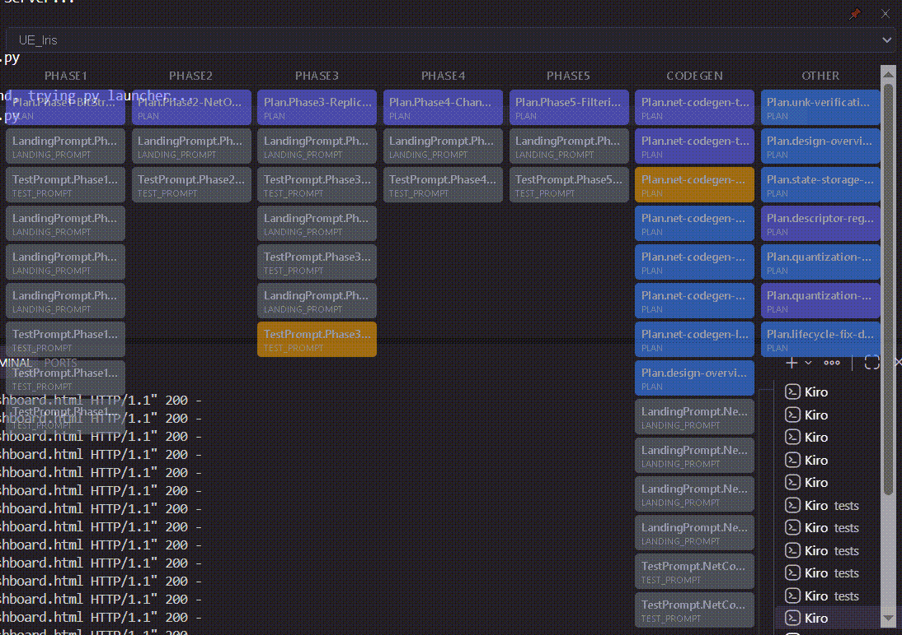
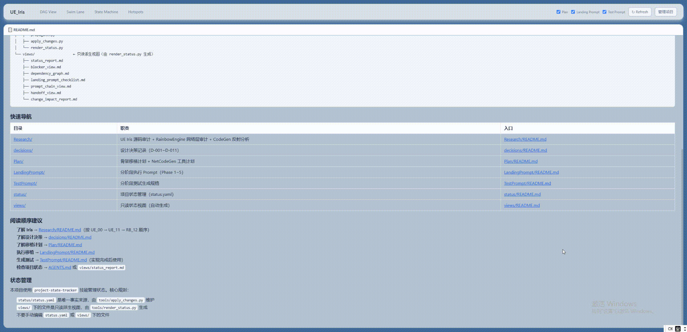

# Plan Viewer

Project State Tracker 的交互式可视化 Dashboard — 桌面版 (Tauri) + 网页版。

## 功能

- DAG 依赖图 / 泳道图 / 状态机视图 / Hotspot 面板
- 点击节点查看详情、依赖、change_events
- 内置 Markdown 预览（README 导读 + artifact 文件）
- 类型 Filter（Plan / LP / TP / Research / Decision）
- 多项目切换（`projects.json`）+ 添加/删除工程
- Glassmorphism 暗色/亮色主题
- 窗口记忆尺寸 + 自动缩小/恢复（dwell 机制）
- Toast 通知反馈（操作成功/失败）
- 状态点击交互（直接修改 artifact 状态）

## 演示

| 桌面版 (Tauri) | 网页版 |
|:-:|:-:|
|  |  |

## 快速开始

```bash
# 网页版
python dashboard_server.py          # 或双击 serve.bat

# 桌面版（一键构建，自动安装 Node/Rust）
build.bat
```

## 技术栈

Python (PyYAML) · React 18 (CDN) · Mermaid.js · marked.js · Tauri + Vite

## 关联 Skill (submodules)

| Skill | 用途 | 仓库 |
|-------|------|------|
| project-state-tracker | 工件生命周期管理 + 状态追踪 | [GitHub](https://github.com/shajieChen/kiro-skill-project-state-tracker) |
| project-state-spec | 三阶段 Spec 编写 (R→D→Task) | [GitHub](https://github.com/shajieChen/kiro-skill-project-state-spec) |
| Execute-LandingPrompt | 执行 LP 并回流状态 | [GitHub](https://github.com/shajieChen/kiro-skill-execute-landingprompt) |

## Skill 闭环工作流

三个 Skill 通过 `status.yaml` 形成自动化闭环：

```
                project-state-spec (PSS)
                │  null → draft (R/D/Plan/LP/TP 注册)
                ▼
status.yaml ──→ render_status.py ──→ prompts/landing/README.md
    ▲                                         │
    │  source: Execute-LandingPrompt          │ ELP 读取 (含 sha256 cache)
    │  draft→ready / ready↔needs_update       ▼
    └──────────────────────────── Execute-LandingPrompt (ELP)
    ▲
    │  AUDIT Step 4: reviewer 推进
    │  R/D/Plan/TP 的 draft→reviewed→approved→ready
    │
project-state-tracker (PST)
```

### 各 Skill 职责

| Skill | 触发 | 对 status.yaml 的写入 | 产出 |
|-------|------|----------------------|------|
| project-state-spec | 用户发起新 spec | `null→draft` | R + D + Plan + LP + TP 文件 |
| Execute-LandingPrompt | 用户指定 LP 文件执行 | `draft→ready` / `ready↔needs_update` | 代码变更 + HC 回流 |
| project-state-tracker | 用户 audit / init | `draft→reviewed→approved→ready` | views/ + AGENTS.md + README |

### 数据流说明

1. **PSS 注册** — project-state-spec 将新 spec 的所有工件以 `draft` 状态写入 status.yaml
2. **PST 渲染** — render_status.py 读取 status.yaml，生成 prompts/landing/README.md（含 LP 序列和 source_root）
3. **ELP 执行** — Execute-LandingPrompt 读取 README.md 获取上下文，执行单个 LP，将结果回流 status.yaml（draft→ready 或 ready→needs_update）
4. **PST 审计** — project-state-tracker AUDIT 检测文件变更，reviewer 推进 R/D/Plan/TP 的状态链（draft→reviewed→approved→ready）
5. **循环** — 状态变更触发 render 更新 README，ELP 下次执行时读取最新状态 → 闭环

## 测试

```bash
pip install -r requirements.txt
pytest tests/
```

## 许可证

MIT — 详见 [LICENSE](LICENSE)
